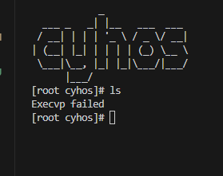

# Day 2 自己实现一部分库函数

为了让昨天实现的 Linux-shell 能够顺利运行在 qemu 中，我们需要支持

- 实现 cyhsh.c 中包含的所有库，由于 cyhsh.c 是用户程序，所以它所包含的库文件也应该是用户文件
- 需要实现以下函数：
    - getcwd
    - printf
    - fork
    - perror
    - exit
    - execvp
    - wait
    - puts
    - chdir
    - strcmp
    - memset
    - readline
    - assert
- 此外，这些程序和文件还必须存放在“磁盘”内，因此我们需要实现一个文件系统

<font color="red">今日目标：<br>1. 实现各个头文件和相应的函数，写好链接脚本，使得 cyhsh.c 能够正常编译链接，甚至运行<br> 2. 可以尝试实现一个文件系统，存放库文件、头文件、以及支持目录等功能 </font>

<font color="orange">需要注意的是，你在实现如自己的 stdio.h 等文件时，部分 gnu-linux 库函数会失效，原因是这些库函数使用了 stdio.h 头文件。如果你要使用这些失效的库函数，那么要么实现一个自己的版本，要么想办法绕开它</font>

## 分析

可以直接实现，不依赖其他部分的函数有:
- printf   stdio.h
- perror   stdio.h
- puts     stdio.h
- strcmp   string.h
- memset   string.h
- readline stdio.h readline/readline.h readline/history.h
- assert   assert.h

需要依赖进程管理系统的函数有：
- fork     sys/types.h  unistd.h
- exit     stdlib.h
- execvp   unistd.h
- wait     sys/types.h  sys/wait.h

需要文件系统的有：

- getcwd   unistd.h
- chdir    unistd.h

## 实现 Step 1 尝试构建 native-vscode-gdb 调试开发环境

参考资料：https://zhuanlan.zhihu.com/p/92175757

在当前文件是C++的情况下，tasks可以被用来做编译，而launch用来执行编译好的文件。

分别配置好 tasks.json 和 launch.json，tasks.json 表明如何构建可执行文件，launch.json 则表明如何使用 gdb

```json
// 如下是 tasks.json
{
    // See https://go.microsoft.com/fwlink/?LinkId=733558
    // for the documentation about the tasks.json format
    "version": "2.0.0",
    "tasks": [
        {
            "label": "Build native-shell",
            "type": "shell",
            "command": "make build/native.elf"
        }
    ]
}
```

```json
// 如下是 launch.json
{
    // Use IntelliSense to learn about possible attributes.
    // Hover to view descriptions of existing attributes.
    // For more information, visit: https://go.microsoft.com/fwlink/?linkid=830387
    "version": "0.2.0",
    "configurations": [
        {
            "name": "Debug native-shell",
            "type": "gdb",
            "request": "launch",
            "target": "./build/native.elf",
            "cwd": "${workspaceRoot}",
            "valuesFormatting": "parseText",
            "preLaunchTask": "Build native-shell",
        }
    ]
}
```

可以按 F5 开始调试程序 cyhsh.c

## 实现 Step 2  printf

创建一个 src/lib/user 目录，用来存放属于用户空间的库文件

再创建一个 src/include/user 目录，用来存放属于用户空间库文件的头文件

在 src/include/user/stdio.h 中，添加 printf 的声明

```c
#ifndef CYHOS_STDIO_H
#define CYHOS_STDIO_H

extern int printf(const char *format, ...);

#endif

```

<font color="orange">在unix的实现中，把许多函数的声明放在同一个头文件 stdio.h 中，而 printf, vsprintf 等函数的实现则分散在不同的文件中</font>

在 src/lib/user/printf.c 中，添加 printf 的实现

```c
#include <stdarg.h>
#include <unistd.h>
#include <stdio.h>

// buf, 静态全局变量，用来存放将要被 printf 或者 sprintf 的字符串
// 使用 static 修饰，防止重名问题
static char buf[1024];

int printf(const char *format, ...)
{
    va_list args;
    int i;

    va_start(args, format);

    i = vsprintf(buf, format, args);

    va_end(args);

    write(stdout, buf, i);

    return i;
}
```

使用可变参数列表去实现 printf 函数

此时只要在 Makefile 中把 src/lib/user/stdio.c 给包含成最终二进制可执行文件的一部分即可，gcc 会使用我们自己编写的 stdio.c 中的 printf 函数 <font color="red">(gcc 在编译的时候，如果遇到和库函数同名的函数，会优先链接同名函数，而非库函数)</font>

```make
	$(BUILD)/lib/user/stdio.o \
```

## 实现 step3 抽象层 

一共用三个命令来指定不同的运行方式

- make ARCH=native-shell run     使用 gnu-linux 环境运行 cyhsh
- make ARCH=native run           使用我们自己编写的库函数，使用 x64 Linux 提供的 API ABI 运行 cyhsh
- make ARCH=x86_64 run           用户程序、库函数、操作系统都是我们自己编写，在 qemu-system-x86_64 上运行

```make
ifeq ($(MAKECMDGOALS), $(filter $(MAKECMDGOALS), native-shell build/native-shell.elf))
# 如果是 native-shell，所有头文件采用 gnu-linux 原生
INCLUDE:=
else
# 否则，使用我们自行编写的 C 库
INCLUDE:=-I$(SRC)/include \
	-I$(SRC)/include/user
endif
```

目前使用 Makefile 中的 ifeq 来判断要包含的头文件，从而控制链接的C库


## 实现 Step 4 stdio.h 头文件中的所有函数，支持 cyhsh 运行起来 --- DOING

cyhsh中涉及的 stdio.h 中的函数一共有四个:
- printf   stdio.h
- perror   stdio.h
- puts     stdio.h
- readline stdio.h readline/readline.h readline/history.h

其中 readline 需要另外两个头文件，由于 readline.h 和 history.h 会调用原生的 stdio.h 中的一些东西，因此我们需要实现我们自己的 readline.h 和 history.h，以兼容我们自己的简化版 stdio.h

如下，是四个函数的实现：
```c
#include <stdarg.h>
#include <unistd.h>
#include <stdio.h>
#include <string.h>

#define BUF_LEN 1024
// buf, 静态全局变量，用来存放将要被 printf 或者 sprintf 的字符串
// 使用 static 修饰，防止重名问题
static char buf[BUF_LEN];

// 主要提供的库函数
int printf(const char *format, ...)
{
    va_list args;
    int i;

    va_start(args, format);

    i = vsprintf(buf, format, args);

    va_end(args);

    write(STDOUT, buf, i);

    return i;
}

void perror(const char *s)
{
    write(STDERR, s, strlen(s));
    write(STDERR, "\n", 1);
}

int puts(const char *s) 
{
    int retval = write(STDOUT, s, strlen(s));
    if(retval < 0)
        return retval;
    return write(STDOUT, "\n", 1);
}

char *readline(const char *prompt)
{
    write(STDOUT, prompt, strlen(prompt));

    read(STDIN, buf, BUF_LEN);

    return (char *)buf;
}
```

如下图是启动的 cyhsh:




实现之后，可以看到成功进入了 cyhsh，但是在执行一些命令的时候会报错，这是因为 stdio.h 中的函数的实现已经被我们修改，而诸如 ls 等命令又使用了这些被我们修改后的库函数，我们自己编写的库函数并不能兼容 ls 等命令的使用，于是报错了

TODO: 为了正确执行 ls 等命令，我们还需要编写自己的 ls 命令等等，但这些都要依赖操作系统的进程调度系统和文件系统，建议先把这些部分补充好

